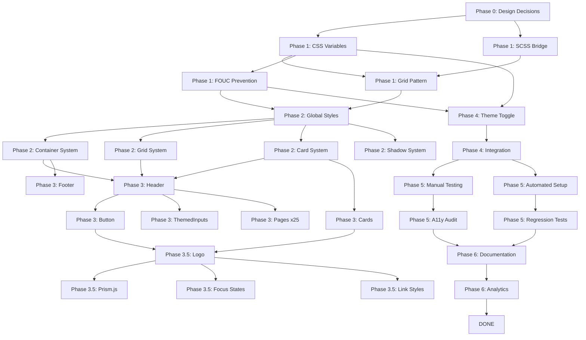

# Light Theme Implementation - Project Structure & Management

> **Scrum Master View** - Dependency-based sprint planning for light theme implementation

---

## 🎯 CLIENT DECISIONS (Product Owner Approved)

### Design Decisions
- ✅ **Background:** Off-white (#fafafa) - less eye strain, premium feel
- ✅ **Grid Opacity:** Moderate (0.06) - balanced visibility
- ✅ **Logo Strategy:** SVG fill inversion (we have source access)

### Scope Decisions
- ✅ **Chatbot:** SKIP - leave dark in light theme (not deployed yet)
- ⚠️ **Reduced Scope:** -5-6 hours (no Phase 3.5 chatbot tasks)

### Technical Decisions
- ✅ **Timeline:** Normal (3-4 weeks) with full testing
- ✅ **Testing:** Add Playwright + Percy automated testing
- ✅ **Browsers:** Modern only (Chrome, Firefox, Safari latest)
- ✅ **Default Theme:** System preference (respects OS setting)
- ✅ **Analytics:** Privacy-first (minimal tracking)

### Deployment Strategy
- ✅ **Rollout:** Feature flag (deploy hidden, test in prod, enable later)
- ✅ **Git Workflow:** Feature branch, commits OK, **NO PUSH to main** without approval

**Revised Effort:** 23-33 hours (was 28-38h, -5h chatbot)

---

## 📊 DEPENDENCY GRAPH & CRITICAL PATH

### Dependency Map



### Critical Path (Longest Dependencies)

**Path 1: CSS Foundation → Components → Testing** (20-25h)
```
Phase 0 (2h) → Phase 1 (3-4h) → Phase 2 (4-5h) → Phase 3 (5-6h)
→ Phase 3.5 (3-4h, no chatbot) → Phase 5 (6-8h)
```

**Path 2: Theme Toggle** (5-6h, parallel to Phase 3)
```
Phase 1 (E) → Phase 4 (2-3h) → Phase 5
```

**Path 3: Testing Infrastructure** (5-7h, can run parallel)
```
Phase 5.9: Playwright Setup (5-7h)
```

**Total Critical Path:** ~25-31 hours
**Parallelizable Work:** ~8-10 hours

---

## 🏃 SPRINT STRUCTURE (2-week sprints)

### Sprint 0: Discovery & Setup (Week 0, 4-6 hours)

**Epic 0.1: Design Validation**
- ✅ DONE: Background color decision (#fafafa)
- ✅ DONE: Grid opacity decision (0.06)
- ✅ DONE: Logo strategy decision (SVG fill)

**Epic 0.2: Project Setup**
- Task 0.2.1: Create feature branch `feature/light-theme`
- Task 0.2.2: Create git tag `v1.0-dark-theme-only`
- Task 0.2.3: Set up project board (GitHub Projects / Jira / Trello)
- Task 0.2.4: Document rollback procedure
- Task 0.2.5: Set up feature flag system

**Epic 0.3: Technical POC**
- Task 0.3.1: Test CSS variable system in Layout.astro (1h)
- Task 0.3.2: Test SCSS bridge with one component (30m)
- Task 0.3.3: Verify logo SVG source access (30m)
- Task 0.3.4: Test grid pattern opacity variants (30m)

**Sprint 0 Deliverable:**
- Feature branch ready
- Technical feasibility confirmed
- Rollback plan documented
- Team aligned on approach

---

### Sprint 1: Foundation (Week 1-2, 10-12 hours)

**Epic 1.1: CSS Variable System** ⚡ CRITICAL PATH
- Task 1.1.1: Create CSS variables in Layout.astro (2h)
  - Define dark theme variables
  - Define light theme variables (using decided colors)
  - Add system preference media query
  - Dependencies: None
  - Blocks: ALL other tasks

**Epic 1.2: SCSS Integration** ⚡ CRITICAL PATH
- Task 1.2.1: Bridge variables.scss to CSS vars (1h)
  - Update `$border-color` to `var(--color-border)`
  - Update `$border-color-hover`
  - Update `$border-color-subtle`
  - Dependencies: 1.1.1
  - Blocks: 1.3, 2.x

**Epic 1.3: Grid System Update** ⚡ CRITICAL PATH
- Task 1.3.1: Update .grid-pattern with CSS vars (30m)
  - Use decided opacity (0.06)
  - Add `--color-grid-line` variable
  - Dependencies: 1.2.1
  - Blocks: All pages with grid backgrounds

**Epic 1.4: FOUC Prevention** ⚡ CRITICAL PATH
- Task 1.4.1: Add inline theme script to Layout.astro (1h)
  - Check localStorage
  - Check system preference
  - Apply theme before render
  - Dependencies: 1.1.1
  - Blocks: 4.x (Theme Toggle)

**Epic 1.5: Shadow System**
- Task 1.5.1: Add shadow CSS variables (30m)
  - Define 4 shadow levels (sm, md, lg, xl)
  - Light theme only (no shadows in dark)
  - Dependencies: 1.1.1
  - Blocks: 2.5, 3.x (hover states)

**Sprint 1 Testing:**
- [ ] CSS variables apply correctly
- [ ] SCSS compilation works
- [ ] No FOUC on page load
- [ ] Grid pattern visible in both themes

**Sprint 1 Deliverable:**
- CSS variable system working
- SCSS bridge functional
- FOUC prevention implemented
- Foundation ready for components

---

### Sprint 2: Core Components (Week 3-4, 12-15 hours)

**Epic 2.1: Global Styles** ⚡ CRITICAL PATH
- Task 2.1.1: Update global.scss (30m)
  - Replace hardcoded colors with CSS vars
  - Dependencies: 1.2.1
  - Blocks: All components

**Epic 2.2: Container System** ⚡ CRITICAL PATH
- Task 2.2.1: Update _containers.scss (1h)
  - `.section-full` background
  - `.section-grid` background
  - `.header-spacer` background
  - Dependencies: 2.1.1
  - Blocks: All pages

**Epic 2.3: Grid & Card System** ⚡ CRITICAL PATH
- Task 2.3.1: Update _grids.scss (1.5h)
  - `.card-item` backgrounds
  - `.card-link` backgrounds
  - Hover states with shadows (light theme only)
  - Dependencies: 2.1.1, 1.5.1 (shadows)
  - Blocks: All card components

**Epic 2.4: Card Styles**
- Task 2.4.1: Update _cards.scss (30m)
  - Card title colors
  - Card content colors
  - Dependencies: 2.1.1
  - Blocks: PostCard, OfferCard, PortfolioItem

**Epic 2.5: Layout Components**
- Task 2.5.1: Update Header.astro (2h)
  - Background colors
  - Text colors (nav links)
  - Border colors
  - Hamburger menu colors
  - Mobile nav overlay
  - Dependencies: 2.2.1
  - Blocks: None (can parallelize with 2.5.2)

- Task 2.5.2: Update Footer.astro (1.5h)
  - Background colors (consider darker footer in light theme)
  - Text colors
  - Border colors
  - Social icon colors
  - Dependencies: 2.2.1
  - Blocks: None (can parallelize with 2.5.1)

**Sprint 2 Testing:**
- [ ] All container backgrounds adapt
- [ ] Card borders visible in both themes
- [ ] Header navigation readable
- [ ] Footer readable
- [ ] Hover states work (with shadows in light theme)

**Sprint 2 Deliverable:**
- Core component system updated
- Header and Footer working
- Card system functional
- Ready for page-level updates

---

### Sprint 3: Pages & Components (Week 5-6, 10-12 hours)

**Epic 3.1: Utility Classes**
- Task 3.1.1: Add Tailwind custom utilities (1h)
  - `.bg-theme-primary`, `.bg-theme-secondary`, etc.
  - `.text-theme-primary`, `.text-theme-secondary`, etc.
  - `.border-theme`, `.border-theme-hover`
  - Dependencies: 1.1.1
  - Blocks: 3.2.x (makes page updates easier)

**Epic 3.2: Critical Pages** ⚡ HIGH PRIORITY
- Task 3.2.1: Update index.astro (30m)
- Task 3.2.2: Update contact.astro (30m)
- Task 3.2.3: Update blog/index.astro (30m)
- Task 3.2.4: Update blog/[postSlug].astro (30m)
- Dependencies: 3.1.1, 2.x
- Blocks: Testing

**Epic 3.3: High Priority Pages**
- Task 3.3.1: Update offer.astro (30m)
- Task 3.3.2: Update portfolio.astro (30m)
- Task 3.3.3: Update about.astro (30m)
- Task 3.3.4: Update Hero.astro (30m)
- Dependencies: 3.1.1, 2.x

**Epic 3.4: Remaining Pages** (can parallelize)
- Task 3.4.1-3.4.18: Update 18 remaining .astro files
- Estimated: 15-20 minutes each = 4-6 hours total
- Dependencies: 3.1.1, 2.x

**Epic 3.5: Specialized Components**
- Task 3.5.1: Update Button.astro (30m)
  - All 4 variants (primary, secondary, outline, filled)
  - Dependencies: 1.1.1

- Task 3.5.2: Update ThemedInput.astro (30m)
  - Investigate existing theme logic
  - Update if needed
  - Dependencies: 1.1.1

- Task 3.5.3: Update ThemedTextarea.astro (30m)
  - Same as above
  - Dependencies: 1.1.1

**Sprint 3 Testing:**
- [ ] All 25 pages render correctly
- [ ] No broken layouts
- [ ] All buttons visible and accessible
- [ ] Form inputs work in both themes

**Sprint 3 Deliverable:**
- All pages updated
- All components working
- Site fully functional in both themes

---

### Sprint 4: Polish & UX (Week 7, 6-8 hours)

**Epic 4.1: Logo Integration** ⚡ HIGH PRIORITY
- Task 4.1.1: Update Logo.astro component (1.5h)
  - Implement SVG fill inversion
  - Test in Header (white → dark)
  - Test in Footer (white → dark)
  - Dependencies: 1.1.1, 2.5.1 (Header done)
  - Blocks: Logo visibility

**Epic 4.2: Code Syntax Highlighting**
- Task 4.2.1: Set up Prism.js theme switching (1h)
  - Add theme-aware CSS loading
  - Test with blog posts
  - Dependencies: 3.2.4 (blog posts done)

**Epic 4.3: Accessibility Polish**
- Task 4.3.1: Add focus states (1h)
  - Define `:focus-visible` styles
  - Test keyboard navigation
  - Dependencies: 1.1.1

- Task 4.3.2: Add link underline styles (30m)
  - Light theme specific
  - Test readability
  - Dependencies: 1.1.1

**Epic 4.4: Theme Toggle Component** ⚡ CRITICAL PATH
- Task 4.4.1: Create ThemeToggle.astro (2h)
  - Sun/moon icons (FontAwesome)
  - Toggle logic
  - LocalStorage persistence
  - Smooth transitions
  - Dependencies: 1.4.1 (FOUC prevention)
  - Blocks: User theme switching

- Task 4.4.2: Integrate into Layout (30m)
  - Add to header or separate position
  - Avoid conflict with chatbot button
  - Dependencies: 4.4.1

**Sprint 4 Testing:**
- [ ] Logo visible in both themes
- [ ] Code blocks readable
- [ ] Focus states visible
- [ ] Theme toggle works smoothly
- [ ] Theme preference persists

**Sprint 4 Deliverable:**
- Logo working
- Theme toggle functional
- Accessibility features complete
- User experience polished

---

### Sprint 5: Testing & QA (Week 8-9, 11-15 hours)

**Epic 5.1: Manual Testing** ⚡ CRITICAL PATH
- Task 5.1.1: Visual testing checklist (3h)
  - 7 pages × 5 breakpoints × 2 themes = 70 tests
  - Document issues in spreadsheet
  - Dependencies: 4.x (all features done)

- Task 5.1.2: Browser testing (2h)
  - Chrome, Firefox, Safari
  - Mobile Safari, Chrome Mobile
  - Dependencies: 5.1.1

**Epic 5.2: Automated Testing Setup**
- Task 5.2.1: Install Playwright + Percy (1h)
  - `npm install -D @playwright/test @percy/cli`
  - Configure playwright.config.ts
  - Dependencies: None (can parallelize with 5.1.x)

- Task 5.2.2: Write theme tests (3h)
  - Theme toggle test
  - Grid pattern test
  - Border visibility test
  - Screenshot tests for all pages
  - Dependencies: 5.2.1

- Task 5.2.3: Create baseline screenshots (1h)
  - Run tests on dark theme (current)
  - Accept as baseline
  - Dependencies: 5.2.2

- Task 5.2.4: Run visual regression (1h)
  - Run tests on light theme
  - Review differences
  - Approve changes
  - Dependencies: 5.2.3

**Epic 5.3: Accessibility Audit**
- Task 5.3.1: Automated a11y testing (2h)
  - Install @axe-core/playwright
  - Run WCAG AA checks
  - Fix violations
  - Dependencies: 5.2.1

- Task 5.3.2: Manual contrast verification (1h)
  - Use WebAIM Contrast Checker
  - Test all text/background combinations
  - Dependencies: None

**Epic 5.4: Specific Component Tests**
- Task 5.4.1: Logo visibility test (30m)
- Task 5.4.2: Third-party components (1h)
  - FontAwesome icons
  - Astro-icon / Lucide
  - Dependencies: 5.1.1

**Epic 5.5: Performance Testing**
- Task 5.5.1: Lighthouse comparison (1h)
  - Before (dark only)
  - After (with theme toggle)
  - Document any regressions
  - Dependencies: 5.1.1

**Sprint 5 Testing Checklist:**
- [ ] All 70 manual test cases passed
- [ ] Visual regression tests pass
- [ ] WCAG AA compliance verified
- [ ] Performance within budget
- [ ] No browser-specific issues

**Sprint 5 Deliverable:**
- All tests passing
- Visual regressions documented and approved
- Accessibility compliance confirmed
- Performance validated

---

### Sprint 6: Launch Preparation (Week 10, 4-5 hours)

**Epic 6.1: Feature Flag Setup**
- Task 6.1.1: Implement feature flag (1h)
  - Add flag check to theme system
  - Default: disabled
  - Can enable via URL param for testing
  - Dependencies: 4.4.2

**Epic 6.2: Documentation**
- Task 6.2.1: Update README (30m)
  - Add theme system section
  - Document CSS variables

- Task 6.2.2: Create CONTRIBUTING.md guidelines (30m)
  - How to use CSS variables
  - Theme testing requirements

- Task 6.2.3: Document rollback procedure (30m)
  - Steps to disable feature flag
  - Git revert instructions
  - Dependencies: 6.1.1

**Epic 6.3: Analytics (Privacy-First)**
- Task 6.3.1: Add minimal theme tracking (1h)
  - Event: theme_changed (dark/light)
  - No PII collected
  - Dependencies: 4.4.1

**Epic 6.4: Pre-Launch Checklist**
- Task 6.4.1: Final review (1h)
  - Test feature flag on/off
  - Verify all docs updated
  - Check git branch ready for merge
  - Dependencies: ALL previous

**Sprint 6 Deliverable:**
- Feature flag working
- Documentation complete
- Analytics in place
- Ready for production deployment

---

## 🎯 EPIC SUMMARY & PRIORITIES

### Must-Have Epics (MVP)
1. ✅ Epic 0.2: Project Setup
2. ⚡ Epic 1.1: CSS Variable System (CRITICAL PATH)
3. ⚡ Epic 1.2: SCSS Integration (CRITICAL PATH)
4. ⚡ Epic 1.3: Grid System (CRITICAL PATH)
5. ⚡ Epic 1.4: FOUC Prevention (CRITICAL PATH)
6. ⚡ Epic 2.1-2.4: Core Styles (CRITICAL PATH)
7. ⚡ Epic 2.5: Header/Footer (CRITICAL PATH)
8. ⚡ Epic 3.2: Critical Pages (HIGH PRIORITY)
9. ⚡ Epic 4.1: Logo Integration (HIGH PRIORITY)
10. ⚡ Epic 4.4: Theme Toggle (CRITICAL PATH)
11. ⚡ Epic 5.1: Manual Testing (CRITICAL PATH)

### Should-Have Epics
12. Epic 1.5: Shadow System
13. Epic 3.3: High Priority Pages
14. Epic 3.4: Remaining Pages
15. Epic 4.2: Prism.js
16. Epic 4.3: Accessibility Polish
17. Epic 5.2: Automated Testing
18. Epic 5.3: A11y Audit

### Nice-To-Have Epics
19. Epic 5.4: Component Tests
20. Epic 5.5: Performance Testing
21. Epic 6.3: Analytics

---

## 📅 GANTT CHART (Text-Based)

```
Week    | Sprint | Epic                          | Hours | Status
--------|--------|-------------------------------|-------|--------
Week 0  | S0     | 0.1 Design Validation        | 0h    | ✅ DONE
        |        | 0.2 Project Setup            | 2h    | 🔲 TODO
        |        | 0.3 Technical POC            | 2h    | 🔲 TODO
--------|--------|-------------------------------|-------|--------
Week 1  | S1     | 1.1 CSS Variables            | 2h    | 🔲 TODO
        |        | 1.2 SCSS Bridge              | 1h    | 🔲 TODO
        |        | 1.3 Grid System              | 0.5h  | 🔲 TODO
        |        | 1.4 FOUC Prevention          | 1h    | 🔲 TODO
Week 2  | S1     | 1.5 Shadow System            | 0.5h  | 🔲 TODO
        |        | S1 Testing                   | 2h    | 🔲 TODO
--------|--------|-------------------------------|-------|--------
Week 3  | S2     | 2.1 Global Styles            | 0.5h  | 🔲 TODO
        |        | 2.2 Container System         | 1h    | 🔲 TODO
        |        | 2.3 Grid & Cards             | 1.5h  | 🔲 TODO
        |        | 2.4 Card Styles              | 0.5h  | 🔲 TODO
Week 4  | S2     | 2.5.1 Header                 | 2h    | 🔲 TODO
        |        | 2.5.2 Footer                 | 1.5h  | 🔲 TODO
        |        | S2 Testing                   | 2h    | 🔲 TODO
--------|--------|-------------------------------|-------|--------
Week 5  | S3     | 3.1 Utility Classes          | 1h    | 🔲 TODO
        |        | 3.2 Critical Pages (x4)      | 2h    | 🔲 TODO
        |        | 3.3 High Priority Pages (x4) | 2h    | 🔲 TODO
Week 6  | S3     | 3.4 Remaining Pages (x18)    | 5h    | 🔲 TODO
        |        | 3.5 Components (x3)          | 1.5h  | 🔲 TODO
        |        | S3 Testing                   | 1h    | 🔲 TODO
--------|--------|-------------------------------|-------|--------
Week 7  | S4     | 4.1 Logo Integration         | 1.5h  | 🔲 TODO
        |        | 4.2 Prism.js                 | 1h    | 🔲 TODO
        |        | 4.3 A11y Polish              | 1.5h  | 🔲 TODO
        |        | 4.4 Theme Toggle             | 2.5h  | 🔲 TODO
        |        | S4 Testing                   | 1h    | 🔲 TODO
--------|--------|-------------------------------|-------|--------
Week 8  | S5     | 5.1 Manual Testing           | 5h    | 🔲 TODO
        |        | 5.2 Automated Setup          | 5h    | 🔲 TODO
Week 9  | S5     | 5.3 A11y Audit               | 3h    | 🔲 TODO
        |        | 5.4 Component Tests          | 1.5h  | 🔲 TODO
        |        | 5.5 Performance              | 1h    | 🔲 TODO
--------|--------|-------------------------------|-------|--------
Week 10 | S6     | 6.1 Feature Flag             | 1h    | 🔲 TODO
        |        | 6.2 Documentation            | 1.5h  | 🔲 TODO
        |        | 6.3 Analytics                | 1h    | 🔲 TODO
        |        | 6.4 Pre-Launch Review        | 1h    | 🔲 TODO
--------|--------|-------------------------------|-------|--------
TOTAL: 58-63 hours over 10 weeks (part-time) or 23-31 hours over 3-4 weeks (full-time)
```

---

## 🚦 STATUS TRACKING

### Overall Progress
- [ ] Sprint 0: Discovery & Setup (0%)
- [ ] Sprint 1: Foundation (0%)
- [ ] Sprint 2: Core Components (0%)
- [ ] Sprint 3: Pages & Components (0%)
- [ ] Sprint 4: Polish & UX (0%)
- [ ] Sprint 5: Testing & QA (0%)
- [ ] Sprint 6: Launch Preparation (0%)

### Risk Register
| Risk | Impact | Probability | Mitigation | Status |
|------|--------|-------------|------------|--------|
| Logo SVG not accessible | HIGH | LOW | Fallback to CSS filter | ✅ Mitigated (confirmed access) |
| Grid pattern too subtle | MEDIUM | MEDIUM | Test multiple opacities | ✅ Mitigated (0.06 chosen) |
| FOUC on page load | HIGH | MEDIUM | Inline script in <head> | 🔲 TODO (Epic 1.4) |
| Browser incompatibility | LOW | LOW | Modern browsers only | ✅ Mitigated (decision made) |
| Performance regression | MEDIUM | LOW | Lighthouse testing | 🔲 TODO (Epic 5.5) |

### Blockers
| Blocker | Blocking | Owner | Status |
|---------|----------|-------|--------|
| None yet | - | - | - |

---

## 📋 SPRINT CEREMONIES

### Sprint Planning (Every 2 weeks)
- Review previous sprint
- Pull tasks from backlog
- Assign story points
- Commit to sprint goal

### Daily Standups (Optional for solo dev)
- What did I do yesterday?
- What will I do today?
- Any blockers?

### Sprint Review (End of each sprint)
- Demo working features to PO (Paweł)
- Get feedback
- Accept/reject work

### Sprint Retrospective
- What went well?
- What needs improvement?
- Action items for next sprint

---

## 🎯 DEFINITION OF DONE

### Task Level
- [ ] Code written and committed to feature branch
- [ ] Tested manually in dark theme
- [ ] Tested manually in light theme
- [ ] No console errors
- [ ] No layout breaks at all breakpoints
- [ ] Code reviewed (self or peer)

### Epic Level
- [ ] All tasks completed
- [ ] Integration tested
- [ ] Edge cases handled
- [ ] Documentation updated (if needed)

### Sprint Level
- [ ] All epics completed or moved to backlog
- [ ] Sprint goal achieved
- [ ] Demo to PO completed
- [ ] Retrospective done

---

## 🔄 WORKFLOW

### For Each Task

```bash
# 1. Start task
git checkout feature/light-theme
git pull origin feature/light-theme

# 2. Do work
# ... make changes ...

# 3. Commit (OFTEN!)
git add .
git commit -m "feat(theme): implement CSS variables system

- Add dark theme variables
- Add light theme variables
- Add system preference media query

Refs: Epic 1.1, Task 1.1.1"

# 4. DO NOT PUSH yet (wait for PO approval)

# 5. Test
npm run dev
# ... manual testing ...

# 6. Update status
# Update task status in this document or project board
```

### For Sprint Review

```bash
# 1. Show changes to PO
npm run dev
# ... demo features ...

# 2. If approved, push
git push origin feature/light-theme

# 3. If needs changes, iterate
# ... make changes ...
git add .
git commit -m "fix(theme): address review feedback"
```

### For Final Merge

```bash
# Only after PO final approval:
git checkout main
git pull origin main
git merge feature/light-theme
git push origin main
```

---

## 📊 METRICS TO TRACK

### Velocity
- Story points completed per sprint
- Use to forecast remaining sprints

### Quality
- Bugs found in sprint review
- Bugs found in QA (Sprint 5)
- Regression count

### Code
- Lines of code changed
- Files modified
- Test coverage (if applicable)

### Time
- Estimated vs actual hours per epic
- Time to fix bugs
- Review/approval time

---

## 🎓 PROJECT MANAGEMENT TIPS

### For You (Developer)
1. **Commit often** - small, atomic commits are easier to review/revert
2. **Update status daily** - keep this doc or project board current
3. **Test as you go** - don't wait until Sprint 5
4. **Ask questions early** - blocked? Ask PO immediately
5. **Document decisions** - why you chose approach X over Y

### For PO (Paweł)
1. **Review sprint demos** - catch issues early
2. **Be available for questions** - unblock developer quickly
3. **Approve commits before push** - maintain quality
4. **Adjust priorities** - backlog is flexible
5. **Celebrate wins** - each sprint completion is progress!

---

## 🚀 NEXT STEPS

1. ✅ Review this project structure
2. 🔲 Set up project board (GitHub Projects, Jira, Trello, or just this doc)
3. 🔲 Approve Sprint 0 to start
4. 🔲 Create feature branch
5. 🔲 Begin Epic 0.2: Project Setup

**Ready to start?** 🎯
