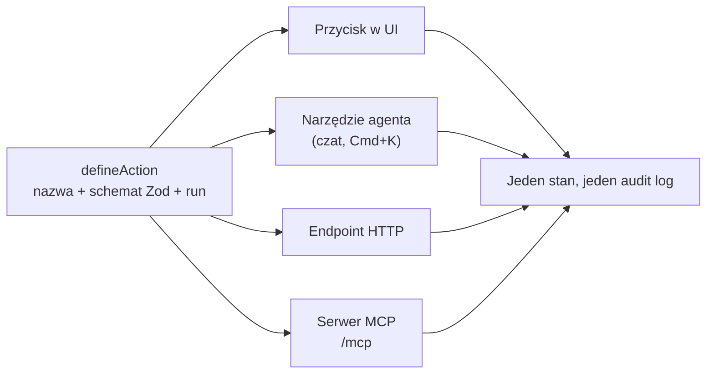

## Part 3 of the multi-interface series

## Why

Większość firm dziś buduje dwie rzeczy osobno: aplikację dla ludzi i chatbota,
który tę aplikację obsługuje z boku. Efekt — chatbot umie odpowiadać na
pytania, ale nie umie nic zrobić, albo robi to inną ścieżką kodu niż
formularz, więc oba się rozjeżdżają. Mam u siebie działający kontrprzykład:
`dispatch.internal`, panel sterowania moimi sesjami Claude Code, zbudowany na
frameworku, w którym nie ma tego rozdziału. Jedna definicja funkcji staje się
naraz przyciskiem, narzędziem agenta, endpointem HTTP i punktem MCP. Warto o
tym napisać, bo to nie jest wizja na 2030 rok — to komponent, który mam
odpalony przez `pm3` na porcie 58080, dziś.

## Angle

Nie "AI zmieni sposób pracy" (to już wie każdy), tylko: **customowy software
robi się tani dokładnie wtedy, gdy framework, na którym stoi, jest sztywny**.
Im więcej decyzji podjął za ciebie framework, tym mniej musi zgadywać agent,
który dla ciebie kod pisze. To pozorny paradoks — mniej wolności programisty,
więcej możliwości firmy — i to jest oś artykułu.

## Framework, na którym stoi moja firma administracyjna

Wewnętrzne oprogramowanie u mnie — panele, dashboardy, narzędzia dla samego
siebie jako "administracji" — piszą w całości agenci. Nie ja klikam UI, nie ja
projektuję schemat bazy. Skutek: mam dziesiątki custom aplikacji, których nikt
by mi nie zbudował za rozsądne pieniądze na etacie — bo koszt custom softu
spadł blisko zera. Ale to działa tylko dlatego, że stoi na frameworku z
mocnymi opiniami: [Agent-Native](https://github.com/builderio/agent-native)
(Builder.io, MIT). Jedna funkcja to jedna definicja `defineAction` — schemat
Zod jako kontrakt, `run` jako logika — a framework sam generuje z niej
przycisk w UI, narzędzie w czacie, trasę HTTP i serwer MCP. Napisz raz, dostań
cztery interfejsy za darmo.

Sztywność frameworku jest tu cechą, nie wadą. Agent piszący dla mnie kod nie
wymyśla za każdym razem, jak podłączyć nową funkcję do czatu, jak ją
zabezpieczyć, gdzie zapisać audyt — bo jest dokładnie jedno miejsce, gdzie to
się robi, i framework to egzekwuje. Mniej możliwości wyboru to mniej okazji,
żeby agent (albo ja) zrobił to inaczej za każdym razem.

## Chat obok UI, nie zamiast UI

Wchodzisz na dowolną stronę `dispatch.internal` — Operations, Approvals,
Integrations, listę zewnętrznych połączeń — i widzisz zwykły interfejs:
tabele, formularze, przyciski. To zostaje, bo człowiek wciąż jest szybszy przy
przeglądaniu listy i klikaniu niż przy opisywaniu tego samego słowami. Obok
stoi czat — jako pełnoekranowa trasa `/chat` i skrótowe menu komend (Cmd+K)
dostępne z każdego miejsca w appce, więc konwersację można otworzyć bez
wychodzenia z kontekstu strony, na której jesteś. Deep-link `?thread=<id>`
otwiera konkretny wątek z dowolnego miejsca w appce.

To odwraca kierunek pracy. UI nie jest już głównym interfejsem, który czasem
odpytujesz botem z boku — jest warstwą weryfikacji nad tym, co robi agent.
Klikasz formularz, kiedy chcesz precyzji. Piszesz do czatu, kiedy chcesz
delegować. Oba trafiają w tę samą akcję, więc oba zostawiają ten sam wpis w
audycie i to samo zdarzenie widać w UI natychmiast po tym, jak zrobił je
agent — żadnego "odśwież stronę, żeby zobaczyć, co ci zrobił bot".



## Każdy endpoint to REST i MCP naraz

Tu trzeba sprostować własne przypuszczenie, bo warto wiedzieć dokładnie, co
się dzieje pod spodem. MCP (Model Context Protocol) nie jest "socketem" w
sensie surowego TCP — ma dwa oficjalne transporty: `stdio` (proces lokalny
gada przez standardowe wejście/wyjście, tak łączy się np. Claude Desktop z
lokalnym serwerem) i **Streamable HTTP** (jeden endpoint HTTP, który przyjmuje
`POST` z żądaniami i opcjonalnie otwiera `GET` jako strumień Server-Sent
Events dla wiadomości płynących z serwera do klienta — następca starszego
transportu HTTP+SSE). Dla aplikacji webowej liczy się drugi wariant: dopisujesz
`/mcp` do adresu appki i dostajesz serwer, który dowolny zewnętrzny agent
(Claude Code, Claude Desktop, Cursor) podłącza jedną komendą:

```bash
claude mcp add my-app --url https://my-app.example.com/mcp
```

Framework generuje ten endpoint z tego samego rejestru akcji co REST-owe
trasy i przyciski UI — konwertuje schemat Zod na JSON Schema i wystawia jako
listę narzędzi `tools/call`. Jeden rejestr, dwa protokoły, zero drugiej
implementacji do utrzymania.

## Podłączasz własnego agenta — ale to wymaga bramek

Skoro `/mcp` stoi obok każdego REST-a, konsekwencja jest prosta: nie musisz
używać czatu wbudowanego w appkę. Możesz podłączyć swojego — Claude, ChatGPT,
własnego agenta na zadanie — i pozwolić mu wykonywać te same akcje co panel.
Ludzie prawdopodobnie tego chcą: jeden agent, którego znają i któremu ufają,
zamiast uczenia się nowego czatu w każdej aplikacji, z którą pracują.

To jednak przesuwa cały ciężar bezpieczeństwa na granicę aplikacji, bo obcy
agent nie jest już "tym samym kodem, który i tak by kliknął formularz" — jest
nieznanym klientem z nieznaną historią. Framework wymusza to, co powinno być
wymuszone niezależnie od niego: uprawnienie i log audytu siedzą **na akcji**,
nie na tym, kto ją wywołał (czwarty z pięciu niezmienników skilla, który stał
u podstaw tego tekstu) — więc agent z rolą "viewer" nie zrobi więcej, niż ta
rola pozwala, bez względu na to, czy woła po HTTP, MCP czy z wnętrza czatu.
Do tego dochodzi to, czego framework nie daje za darmo i co trzeba dopisać
samemu: uwierzytelnianie konkretnego agenta (nie tylko konkretnego usera),
limity zapytań, i twarda walidacja wejścia na granicy — bo scheme Zod łapie
kształt danych, nie intencję. "Read-only MCP" jest tu antywzorcem z drugiej
strony: appka, która agentowi daje tylko odczyt, a każdą zmianę zostawia
człowiekowi, nie jest agent-native — to help desk z ładniejszym interfejsem.

## Jeszcze cztery wzorce agent-native, które już u mnie działają

Poza samym frameworkiem, w moim harnessie funkcjonują cztery pokrewne wzorce
— różne wcielenia tej samej zasady: jedna definicja, wiele interfejsów.

1. **Multi-interface przez content negotiation.** Ta sama strona `.internal`
   odpowiada inaczej w zależności od nagłówka `Accept`: `text/html` renderuje
   widok dla człowieka, `text/markdown` zwraca surowe źródło MDX dla agenta —
   bez szumu HTML, bez tokenów zmarnowanych na layout. Jeden URL, jedna treść,
   dwóch czytelników. To dokładnie ten sam ruch co `defineAction` — tylko na
   poziomie treści, nie akcji.

2. **Broker zamiast bezpośredniego dostępu do sekretu.** `password-broker` i
   `consent-broker` to agent-native wersja invariantu #4 rozciągnięta poza
   akcje na dane wrażliwe: agent może w pełni **używać** hasła (`inject`) albo
   żądać zgody na ryzykowny krok (`elevate`), ale nigdy nie widzi wartości ani
   nie omija realnego kliknięcia człowieka. Uprawnienie siedzi na bramce, nie
   na agencie, który akurat prosi.

3. **Wyspecjalizowani agenci zamiast jednego god-agenta.** Piąty niezmiennik
   skilla, widoczny wprost w `dispatch.internal` — zakładka "Agents" zamiast
   jednego czatu do wszystkiego. Osobny agent do repo (`giter`), osobny do
   procesów (`pm`), osobny do wiedzy (`knowledge`) — każdy z wąskim zestawem
   narzędzi, rozmawiający z resztą przez A2A zamiast dźwigać cały kontekst
   naraz.

4. **Zero-tokenowe CLI jako piąty interfejs tej samej akcji.** Bang-commands
   (`~/.claude/bin/`) to deterministyczne skrypty, które robią dokładnie to,
   co zrobiłby przycisk UI albo narzędzie agenta — ale bez modelu w pętli.
   Piąta gałąź na tym samym diagramie fan-out: UI, agent, HTTP, MCP i teraz
   goły shell, wszystkie prowadzące do tej samej logiki.

## Czego jeszcze nie widziałem u siebie w praniu

Framework jest wczesny — tylko `@latest`, brak wersji z tagiem — więc traktuję
go jako spike, nie fundament pod produkcję: przypinam, weryfikuję adapter D1
przed migracją realnego schematu, sprawdzam historię auth w MCP, zanim
wystawię akcję zmieniającą stan publicznie. `dispatch.internal` działa u mnie
lokalnie i stabilnie od tygodni, ale to jedna instancja, jeden użytkownik —
uczciwie: nie mam jeszcze dowodu, jak ten wzorzec zachowuje się pod wieloma
zewnętrznymi agentami na produkcji.

## Links

- Skill źródłowy: `C:/Users/zentala/.claude/skills/agent-native/SKILL.md`,
  `ref/framework.md`, `ref/pattern.md`.
- Instancja opisana w artykule: `C:/Users/zentala/code/dispatch.internal`
  (`app/root.tsx`, `app/dispatch-extensions.tsx`) — `pm3.yaml`, domena
  `dispatch.internal` w `C:/code/internal-domains/domains.yaml`.
- MCP transporty: specyfikacja `modelcontextprotocol.io` — `stdio` i
  Streamable HTTP (następca HTTP+SSE).
- Pokrewny wpis: `multi-interface-jedna-tresc-dla-czlowieka-i-agenta.mdx`.
- Pokrewny wpis: `drugi-broker-agent-nigdy-nie-wysyla-sekretu.mdx`.
