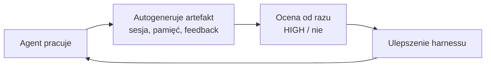

## Part 3 of the agent-native harness series

## Why

Zwykle myślimy: zadaniem agenta jest produkować **kod**. Ale coraz więcej
wartości leży obok — w tym, że agent produkuje **treść dla samego siebie** (i dla
następnej sesji). Zapis sesji, notatki między-sesyjne, feedback o toolingu,
oceny incydentów — to wszystko treść, której nikt nie pisał ręcznie: wygenerował
ją agent przy okazji pracy. To jest, moim zdaniem, jedna z tych wielkich rzeczy,
które dopiero się rozkręcą: **autogenerowanie**.

## Angle

Autogenerowanie to nie „agent gada do siebie" — to celowe wytwarzanie
artefaktów, które **domykają pętlę samodoskonalenia**. Przykłady, które już u
mnie działają:

- **Zapis sesji** — każda sesja zostawia checkpoint/summary; następna startuje
  z kontekstem, nie od zera.
- **Pamięć między-sesyjna** — dziennik agenta o mnie i o własnej skuteczności
  (dokładnie ta klasa „memory", którą Anthropic w pewnym momencie wyłączyło —
  a którą można sobie odtworzyć samemu).
- **Feedback do KB** — agent po pracy zapisuje incydent o toolingu i OD RAZU go
  ocenia (HIGH/nie), tworząc materiał, na podstawie którego później ulepszamy
  harness. To nie log — to paliwo do pętli self-improvement.

Sedno: agent normalnie wykonuje robotę, ale **ustawiamy go tak, żeby zadawał
sobie właściwe pytania po drodze** — „jak mogę odciążyć poznawczo użytkownika?",
„jakie decyzje on często podejmuje, żebym umiał je przewidzieć?", „co z tej
sesji warto utrwalić?". Odpowiedzi na te pytania to właśnie autogenerowana
treść. Agent uczy się na swoich błędach, bo najpierw je sobie zapisuje i ocenia.

Drugi wątek do rozwinięcia: **autogenerowanie a oszczędność kontekstu.** Skoro
agent może wytworzyć trwały artefakt (regułę, notatkę, podsumowanie), to część
wiedzy nie musi wisieć w kontekście — jest wyprodukowana raz i odłożona tam,
gdzie odpali się sama. Autogenerowanie i progressive disclosure to dwie strony
tej samej monety: mniej trzymać w głowie, więcej odkładać do miejsca zapłonu.

## Wykres — pętla self-improvement napędzana autogenerowaniem

## Outline (do rozpisania)

1. Teza: cel agenta ≠ tylko kod; też treść dla agenta.
2. Katalog przykładów autogenerowania (sesje, pamięć, feedback, oceny).
3. Pętla: generuj → oceń → ulepsz harness → powtórz.
4. Związek z oszczędnością kontekstu (co można zautomatyzować/odłożyć).
5. Dlaczego to urośnie: im dłużej agent żyje, tym więcej sam sobie pisze.

## Links

- Rodzeństwo: `agenci-zostawiaja-feedback-o-toolingu.mdx` (jedna z pętli),
  `trzasanie-drzewem-pomyslow-agenta-pytaniami.mdx` (źródła samoulepszania),
  `progressive-disclosure-komunikacja-bez-przeciazenia.mdx` (druga strona monety)
- Kontekst: KB feedback, dziennik agenta (`~/.kb/journal/`), epic E004 (kontekst)
