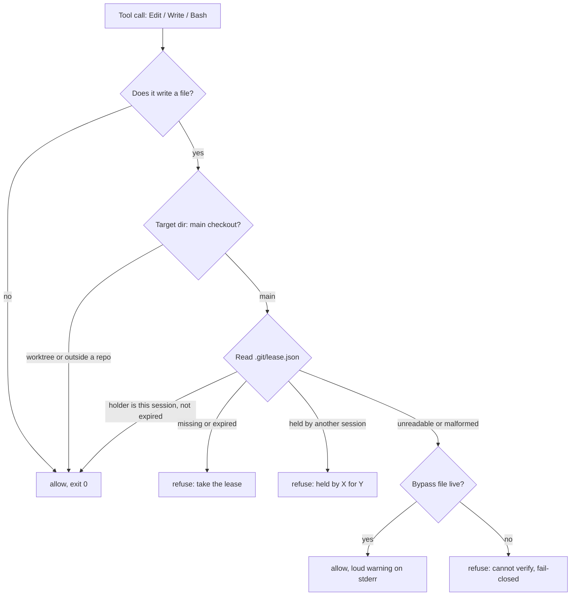

Running several coding agents against one repository is how you get more done without switching context: one checkout, one set of tabs, three tasks moving at once. It is also how one agent's staged file rides along in another's commit, a `git checkout -- <file>` discards a neighbour's uncommitted lines, and the second write to a shared path wins with no error for either side.

## The architecture

Three rules, three parts, one afternoon.

| Rule | Enforced by |
|---|---|
| Real work happens in a **worktree**. The main checkout is **merge-only**. | A hook that classifies the target directory as *main* or *worktree* and refuses writes to *main* without a lease |
| Only **one session** may write the main checkout at a time. | A **holder file** inside `.git/` naming that session, with a TTL |
| The gate must never be the reason nobody can work. | A named, logged, time-boxed **bypass** |



No daemon. The hook reads a file; the commands write it. A daemon is an optimisation for the day you have many machines or hundreds of calls a second, and you do not have that day yet.

## Part 1: what counts as protected

Protected means *the main checkout of a repository*. A worktree is exempt by design: it has its own index and its own `HEAD`, so two agents in two worktrees cannot clobber each other's files, and the rule has nothing to do there. Outside any repository the hook has nothing to say either.

The classification is one git call, cached per session and per directory:

```sh
git rev-parse --path-format=absolute --git-common-dir --git-dir
```

| The two paths | Meaning |
|---|---|
| equal (`<repo>/.git` twice) | main checkout → protected |
| differ (`<repo>/.git` vs `<repo>/.git/worktrees/<name>`) | worktree → exempt |
| command fails | not a repository → exempt |

You choose what is protected by choosing where agents run. Start every agent in its own worktree (`git worktree add ../<name> -b <branch>`) and the gate almost never fires; it exists for the one place that must stay shared, the checkout that merges are landed into.

## Part 2: the holder file

`<repo>/.git/lease.json`. Inside `.git/` so it is never committed and travels with the repository, not with the machine's temp dir.

```json
{
  "holder": "3e0a9163-3e44-4c37-afd7-78c50cfefa6c",
  "kind": "agent",
  "purpose": "merge feature branch into main",
  "acquired_at": "2026-09-08T14:02:11.412Z",
  "renewed_at": "2026-09-08T14:05:41.009Z",
  "ttl_s": 30
}
```

Three numbers govern it and they form a ladder: **renew every 10 s < TTL 30 s < takeover after 60 s of silence.** Renewal shorter than TTL means an ordinary scheduling delay never costs a healthy holder its lease. Takeover strictly longest means a hiccup can never look like a dead holder to a rival.

| Operation | What it does to the file |
|---|---|
| **acquire** | Create with the exclusive flag (`wx`). Exists and `renewed_at` younger than TTL → refuse, print holder. Exists and older than TTL → delete, then create. |
| **renew** | Rewrite `renewed_at`. Only the holder does this. |
| **release** | Delete the file. Only the holder. |
| **takeover** | Allowed only when `renewed_at` is older than 60 s; logs the previous holder and purpose before overwriting. |
| **status** | Print the file, or `free`. |

Renewal is the part people get wrong. Do not put it on a timer; tie it to something the holder already does constantly. A `PostToolUse` hook that rewrites `renewed_at` whenever the holding session finishes any tool call means a working agent cannot forget to renew, and only a stuck or dead one goes quiet, which is exactly the case the TTL is for.

**Identity is the session, not the process.** The agent runtime spawns a fresh process per command; a process id would look like a new holder every renewal. The hook receives the session id on stdin and uses that. One simplifying assumption, stated plainly: within one lease, the orchestrating agent and its subagents share access, because the parent coordinates them. Subagents present the parent's session id.

Exclusive create closes the race between two agents acquiring in the same millisecond on one machine. Across machines on a network share it does not, and that is the point at which a daemon starts to earn its place.

## Part 3: the hook

Your agent runtime's `settings.json`, under `hooks.PreToolUse`:

```json
{
  "matcher": "Edit|Write|MultiEdit|NotebookEdit|Bash",
  "hooks": [{ "type": "command", "command": "node \"$HOME/hooks/lease-guard.mjs\"" }]
}
```

The hook gets one JSON object on stdin and answers with an exit code:

| Field on stdin | Used for |
|---|---|
| `tool_name` | which detector runs |
| `tool_input.file_path` (Edit, Write) | the target; its directory is classified |
| `tool_input.command` (Bash) | parsed for writes; every directory it names is classified, and the first *main* among them decides |
| `cwd` | resolving relative paths |
| `session_id` | identity |

| Exit code | Effect |
|---|---|
| `0` | tool call proceeds |
| `2` | tool call refused; whatever the hook wrote to stderr is shown to the model |
| anything else | treated as a hook error; the guard exits `0` on its own internal errors so it is never the reason a session breaks |

Deciding whether a Bash command *writes* is the only heuristic in the design, and the one that has to be precise (see the traps below). Three signals, each matched only in command position:

| Signal | Pattern |
|---|---|
| git verbs that move the index or the tree | `commit merge rebase reset checkout restore switch cherry-pick revert am apply stash` |
| writer commands | `tee cp mv rm dd install truncate sed -i perl -i patch` |
| redirection | `>` / `>>` whose target is not `/dev/null`, `nul` or `$null` |

## Part 4: the commands

One script, five verbs, all operating on the holder file above.

```sh
lease acquire <repo> --purpose "merge feature branch" --session $SESSION_ID
lease renew   <repo> --session $SESSION_ID
lease release <repo> --session $SESSION_ID
lease status  <repo>
lease bypass  --reason "lease file corrupt after crash" --minutes 15
```

`bypass` does not touch the repository. It writes `{reason, expiresAt}` to the OS temp dir so a reboot clears it, and the hook honours it only on the *cannot read the holder file* branch, never on *held by someone else*.

## What the agent sees

Paste these into your hook. The wording is the interface: a refusal that does not say what to do next teaches the agent to reword the command until the gate misses.

Refused, main is merge-only:

```
BLOCKED: main checkout is merge-only (held by agent 3e0a9163 for "merge feature branch").
  Work in a worktree:  git worktree add ../<name> -b <branch>
  Or take the lease:   lease acquire <repo> --purpose commit --session <id>
```

Refused, neighbours present (a second hook on the `Task` tool that reads a presence registry):

```
BLOCKED: 2 agent(s) are already live in this repository and you are in the
main checkout. Give this agent its own worktree first:
  git worktree add <repo>/../<name> -b <branch>
```

Refused, cannot verify:

```
BLOCKED: the lease file could not be read, so the main-checkout guard cannot
verify this write (fail-closed).
  Fix:     lease status <repo>
  Or bypass (logged, expires): lease bypass --reason "<why>" --minutes 15
```

Allowed under bypass, every single call:

```
lease-guard: BYPASS active ("lease file corrupt after crash", 11m left)
— the merge-only invariant is NOT enforced for this call.
```

## The neighbour layer

The lease answers "may I write here". A second, cheaper layer answers "who else is here and what are they touching". It is a small shared record of live sessions and the file globs each has claimed, read by the same kind of hook.

| Check | Refuses |
|---|---|
| Presence | starting a second agent in the main checkout while another session is live there (the message above) |
| Claim overlap | an Edit or Write whose path falls inside a glob another live session has claimed |
| Sweep | `git add -A`, `commit -a`, bare `checkout --`, `stash` with no pathspec, named by whose claimed files they would silently take |

None of it needs the lease. A command that touches everything is wrong regardless of who holds main.

## Fail closed, and the rescue that keeps it switched on

When the hook cannot read the holder file, the answer is *unknown*, and unknown is never *allowed*. It refuses.

The counterweight is as real: a guard whose failure mode is "nobody can work" gets switched off within a week, and then it guards nothing. So the rescue path is part of the design, not an afterthought. It has a name (`bypass`), it is logged with a reason, it expires on its own, and every call it lets through prints the warning above. A silent override would be worse than no guard.

What earned the gate the right to refuse rather than warn was measuring it: **p99 of 0.342–0.422 ms per call** over three runs of 1000 calls each, 10–13× under a 5 ms budget. A gate that cheap gives nobody a reason to disable it.

## Three traps

Each one made the gate look like it was working while it was not.

| Trap | What happened | Fix |
|---|---|---|
| Write-detector too eager | Counted `=>` inside a JavaScript snippet and `>/dev/null` as writes. Agents did not report the false positive; they reworded commands until the pattern missed. | Match writer commands in command position only; exclude null-device targets. Treat every false positive as a bug in the gate. |
| Path resolver blind to `~` | Every path spelled with the home shorthand escaped classification. The gate never saw the writes it existed to refuse. | Expand `~` before resolving. Test the gate against every spelling your platform allows: relative, absolute, shorthand, symlink, junction. |
| One word, two failures | "Wrote outside the declared file set" and "merge target was dirty before you started" logged under the same word. | Cost forty minutes of misdiagnosis. Distinct failures get distinct names. |

## What it costs to build

Not a framework. Three files.

| Piece | Size |
|---|---|
| Holder file | one JSON object, written by the commands, read by the hook |
| Hook script | classify directory, detect write, read file, print message, exit `0` or `2` |
| Settings entry | the one JSON block in Part 3 |

The `lease` command is the same read/write logic as the hook with five verbs on top. A presence registry and a `PostToolUse` renew hook are the two optional additions after that.

## What it removes, and what it does not

| Removed | By |
|---|---|
| Silent overwrite / clobber on the main checkout | one writer at a time |
| Stray files in someone else's commit from a shared index | agents in worktrees; main is merge-only |
| `checkout --` / `stash` / `add -A` sweeping a neighbour's lines | git verbs gated on main; sweep detector on unscoped commands |
| A crashed holder blocking everyone | TTL, then takeover |
| A dead gate that looks alive | fail-closed with a loud bypass |

Not removed, said plainly:

- **Git lock contention while creating worktrees.** Ten agents running `git worktree add` at once still collide on `.git/config.lock`. Serialise worktree creation yourself.
- **Two agents picking up the same task.** The lease is about files, not work assignment. That needs a task claim at dispatch time.
- **A worktree that escapes.** A worktree is exempt, and the stash stack is shared across the whole family. An agent that stashes from inside a worktree is stashing the family's stash. The lease does not see it.
