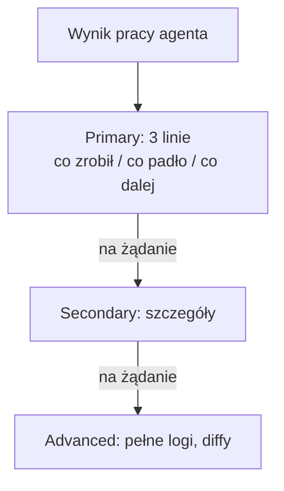

## Part 6 of the agent-native harness series

## Why

Agent, który wywala mi ścianę tekstu, jest gorszy niż agent, który powie mniej.
Nadzoruję kilka sesji naraz i jestem zmęczony — moim wąskim gardłem nie jest to,
ile agent wyprodukuje, tylko ile JA jestem w stanie przyjąć. Jak nauczyć agenta
komunikować się tak, żeby mnie NIE przeciążyć poznawczo — żebym ogarniał więcej,
a nie mniej? To jest osobna umiejętność, tak samo ważna jak pisanie kodu.

## Angle

To jest **progressive disclosure** przeniesione z UI na komunikację agent→człowiek.
Zamiast wysypać wszystko naraz, agent układa informację w drabinę:

- **Primary** — 3 linie: co zrobił, co padło, co dalej. Zawsze najpierw.
- **Secondary** — szczegóły na żądanie, nie z automatu.
- **Advanced** — pełne logi/diffy, tylko gdy poproszę.

Do tego kilka twardych reguł, które u mnie działają:

- **Kontekst przed werdyktem.** Nie pamiętam starych projektów — każda ocena
  zaczyna się od 1-2 zdań „co to jest / jak działa dziś", DOPIERO potem werdykt.
- **Tabela zamiast ściany.** Przegląd wielu rzeczy = wiersz na rzecz, kolumny na
  statusy. Infografika/diagram bije prozę.
- **Czasowniki operacyjne czytane dosłownie.** „Zapisz plan" ≠ „wykonaj". Mniej
  domyślania = mniej mojego wysiłku na prostowanie.
- **Decyzje tylko tam, gdzie realny kompromis.** Oczywiste wygrane agent wdraża
  sam i melduje jednym zdaniem; pyta jedynie, gdy stawką jest coś nieodwracalnego
  albo kwestia gustu. Odciążanie mnie z decyzji to część tej samej roboty.

Puenta: **to nie jest kosmetyka, to zarządzanie moją uwagą.** Agent, który
dawkuje kontekst, realnie zwiększa, ile projektów jestem w stanie prowadzić —
bo koszt nie jest w tym, co agent robi, tylko w tym, co ja muszę przeczytać.

## Wykres — drabina kontekstu, szczebel na żądanie

## Outline (do rozpisania)

1. Wąskie gardło to człowiek, nie agent — koszt jest po stronie czytania.
2. Drabina primary/secondary/advanced.
3. Reguły: kontekst przed werdyktem, tabela, dosłowne czasowniki, auto-approve.
4. Native HTML nad JS+ARIA (details/summary, popover) — gdy to jednak strona.
5. Efekt: więcej równoległych projektów przy tej samej uwadze.

## Links

- Reguła u mnie: CLAUDE.md „Presenting & reading commands", skill
  `progressive-disclosure`, reguła auto-accept
- Rodzeństwo: `autogenerowanie-tresci-dla-agenta.mdx` (druga strona: mniej
  trzymać w kontekście), `trzasanie-drzewem-pomyslow-agenta-pytaniami.mdx`
